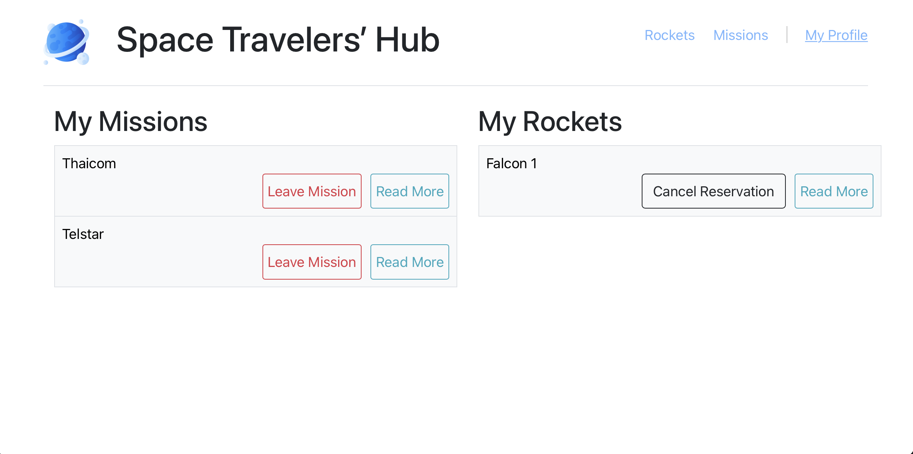
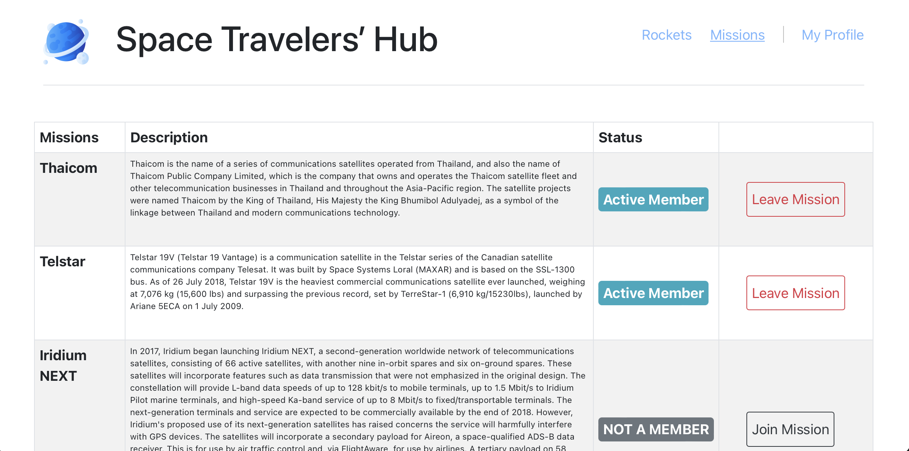
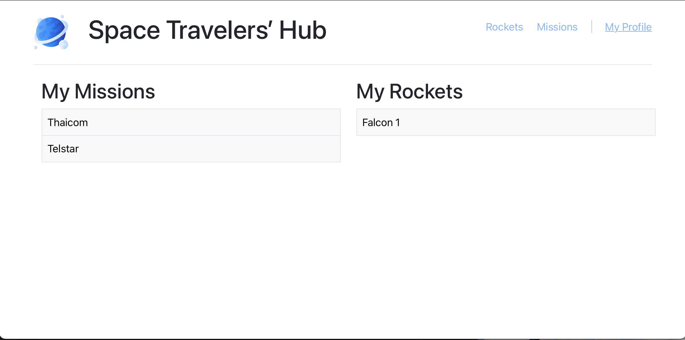

# Space Travelers' Hub

> This is In this task, we work with the real live data from the SpaceX API. We build a web application for a company that provides commercial and scientific space travel services. The application will allow users to book rockets and join selected space missions.

## Built With

- JavaScript
- React
- Redux
- API Gateway

## Screenshot




## Live Demo

[coming soon]() 😎

## Getting Started

1. Open [dev branch](https://github.com/Tadesse-Alemayehu/space-travlers)
2. Open VSCode or terminal and navigate to the folder where you would like to clone the project.
3. Type "pwd" to see your working directory.
4. [clone repository](https://github.com/Tadesse-Alemayehu/space-travlers)(git clone "branch-link")
5. Run
```bash
$ npm install # to install required packages
$ npm run start # to start the website on local server
```
6. Enjoy 😎

## Authors 👱‍♂️

👤 **Jorge Rios**

- GitHub: [@Alexr16](https://github.com/Alexr16)
- Twitter: [@ReveloJ](https://twitter.com/ReveloJ)
- LinkedIn: [Jorge Ríos](https://www.linkedin.com/in/jorgeriosr/)

👤 **Tadesse Alemayehu**

- GitHub: [@githubhandle](https://github.com/Tadesse-Alemayehu)
- Twitter: [@twitterhandle](https://twitter.com/TadesseWebDev)
- LinkedIn: [LinkedIn](https://www.linkedin.com/in/tadesse-alemayehu-60141a221/)

## Show your support

Give a ⭐️ if you like this project!

## Submit an issue

[Issue page](https://github.com/Tadesse-Alemayehu/Bookstore/issues)

## Acknowledgments

- Microverse for amusing learning resources.
- Microverse code reviewers.
- You! 😄 yes you... for visiting.

## 📝 License

LICENCED UNDER [MIT License](LICENSE)
